# AllinOne 使用手册

> 适用对象:业务填报人员、报表使用者与系统管理员。
> 本手册覆盖从登录到数据填报、报表查看的完整业务流程。截图以演示环境为例,实际界面可能因权限配置略有差异。

---

## 目录

1. [系统简介](#1-系统简介)
2. [登录与首页](#2-登录与首页)
3. [数据填报](#3-数据填报)
   - 3.1 [分类管理](#31-分类管理)
   - 3.2 [填报模板](#32-填报模板)
   - 3.3 [在线表格设计器使用要点](#33-在线表格设计器使用要点)
   - 3.4 [在线填报](#34-在线填报)
   - 3.5 [填报数据管理](#35-填报数据管理)
   - 3.6 [字段映射(进阶)](#36-字段映射进阶)
4. [报表管理](#4-报表管理)
5. [系统管理](#5-系统管理)
6. [权限速查表](#6-权限速查表)
7. [常见问题 FAQ](#7-常见问题-faq)

---

## 1. 系统简介

AllinOne 是一体化企业级报表管理系统,围绕"**数据收集 → 数据存储 → 数据展示**"提供三大能力:

| 能力 | 说明 | 典型场景 |
|------|------|---------|
| 📊 **数据收集** | 类 Excel 的在线表格填报,支持公式、多 Sheet、图片 | 日报/周报/月报、预算填报、数据采集 |
| 📈 **报表展示** | 拖拽式设计复杂报表,支持打印、套打、多格式导出 | 销售汇总、对账单、运营月报 |
| 📉 **数据可视化** | 数据大屏与仪表盘 | 领导驾驶舱、运营监控中心 |

系统菜单分为四大块:**数据填报**(分类管理/填报模板/我的填报/字段映射)、**报表管理**(报表配置/报表分类/大屏管理/报表查看)、**系统管理**与**系统监控**(管理员使用)。

> 💡 较早部署的实例菜单目录可能仍显示旧名称"业务管理/报表中心",功能完全一致;新部署实例已对齐设计命名。

## 2. 登录与首页

### 2.1 登录系统

1. 打开浏览器,访问系统地址(例如 `http://服务器IP/`)。
2. 输入**用户名**、**密码**和**图片验证码**(算术题,输入计算结果即可;点击图片可刷新)。
3. 勾选"记住密码"可在下次自动填充账号(公共电脑不建议勾选)。
4. 点击 **登 录** 进入系统。

> 💡 **提示:** 密码连续错误 5 次将锁定 10 分钟;登录会话默认 30 分钟无操作后过期,过期后重新登录即可。

### 2.2 系统首页

登录后进入首页工作台。左侧为功能菜单树,顶部为页签栏(可同时打开多个功能页,支持切换与刷新),右上角为消息通知与个人中心。

### 2.3 个人中心与退出

点击右上角头像下拉菜单,可进入**个人中心**(修改密码、头像等)或**退出登录**。

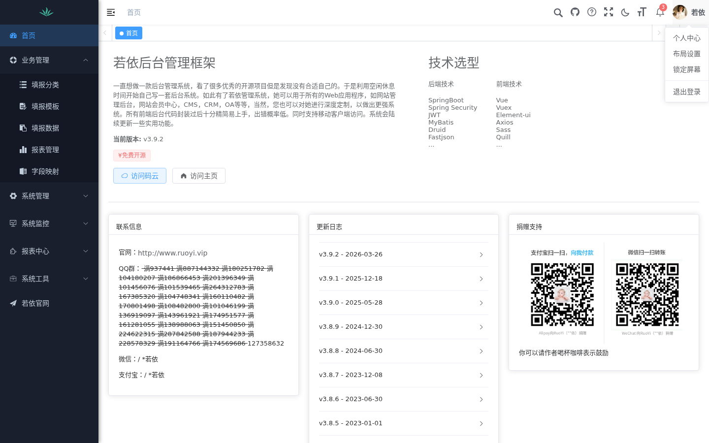

## 3. 数据填报

数据填报的标准流程是:**建立分类 → 创建并发布模板 → 在线填报 → 提交数据 → 查看回放**。以下以"区域销售月报"为例完整演示。

### 3.1 分类管理

分类用于按业务归组填报模板(如"人事管理/财务管理/销售管理")。

**操作路径:** 数据填报 → 分类管理

1. 点击 **新增**,填写分类名称,确定后立即生效。
2. 已有分类可**修改**;分类下存在子分类时不允许删除,请先删除或移走子分类;分类下存在模板时同样不允许删除。

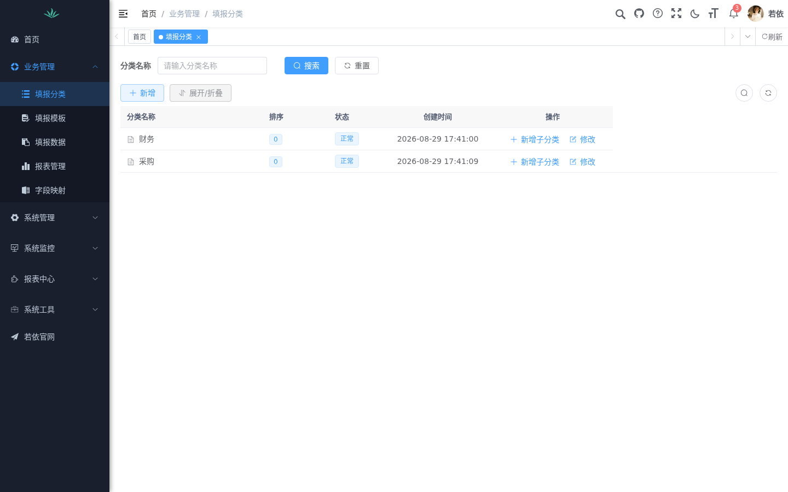

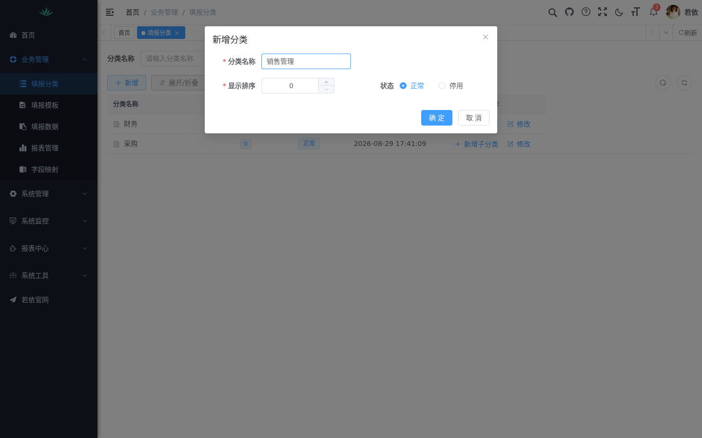

### 3.2 填报模板

模板定义填报的表格样式(表头、格式、公式),填报人基于已发布的模板录入数据。

**操作路径:** 数据填报 → 填报模板

**创建模板:**

1. 点击 **新增**,填写模板名称与模板编码(编码全局唯一,创建后不可与已有编码重复),选择所属分类。
2. 确定后在列表中生成"未发布"状态的模板。

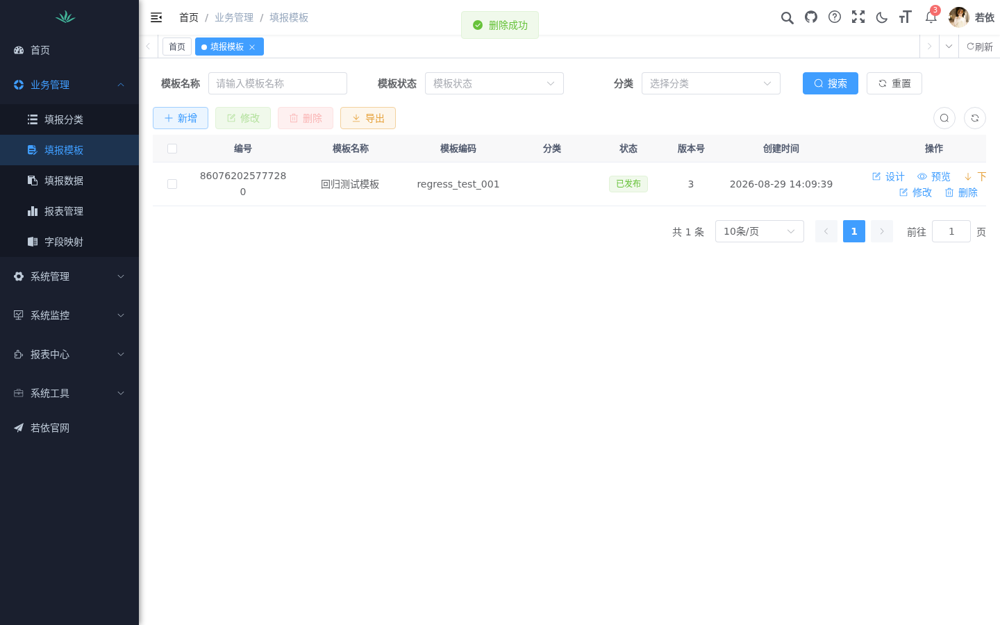

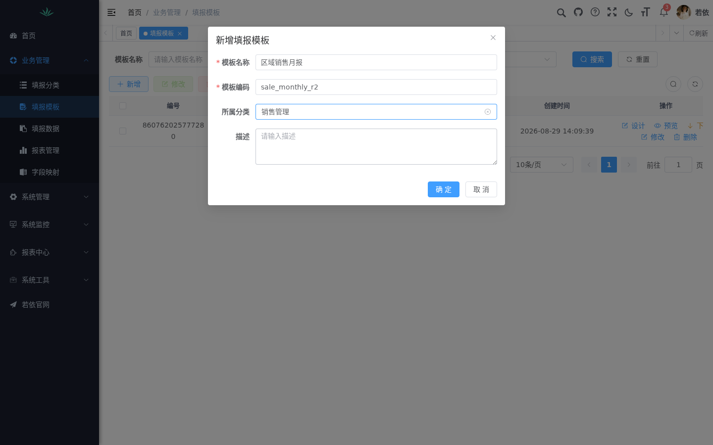

**设计模板(核心步骤):**

1. 在列表中点击 **设计**,进入在线表格设计器。设计器与 Excel 操作习惯一致,可直接输入内容、设置格式。

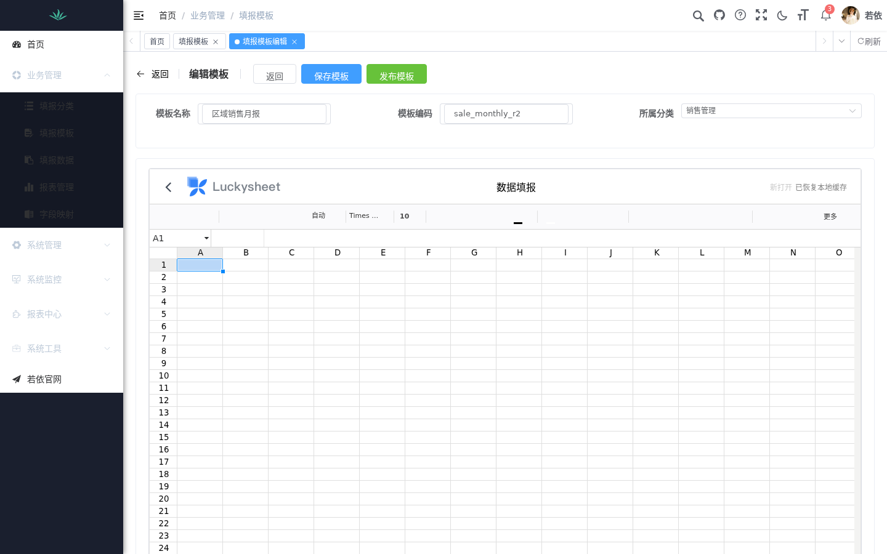

2. 录入表头与示例数据,支持 Excel 风格公式(如 `=SUM(C3:C4)`),公式会自动计算。
3. 选中单元格后可用顶部工具栏设置**加粗**、字体、边框、对齐、小数位等格式。

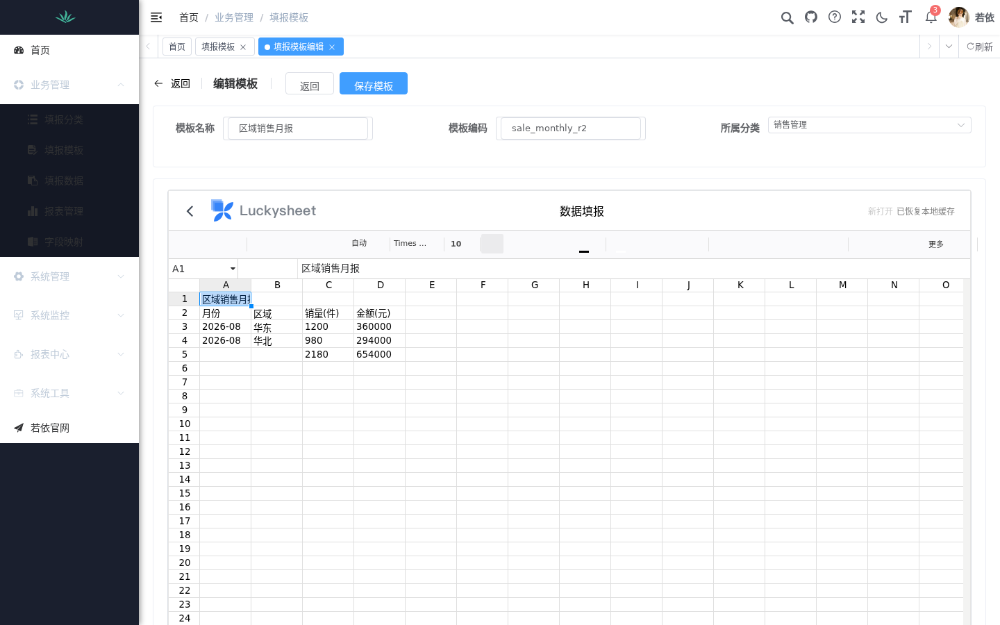

> 💡 **设计建议:** 第 1 行放报表标题,第 2 行放表头,数据行留空或填示例;公式列提前写好,填报人只需填基础数据。设计器支持多 Sheet(底部页签)、冻结行列(视图菜单),适合复杂表头场景。

**保存与发布:**

3. 点击右上角 **保存模板** 保存设计。
4. 点击 **发布模板** 并确认。**只有已发布的模板才会出现在填报入口**,未发布/已下架模板对填报人不可见。

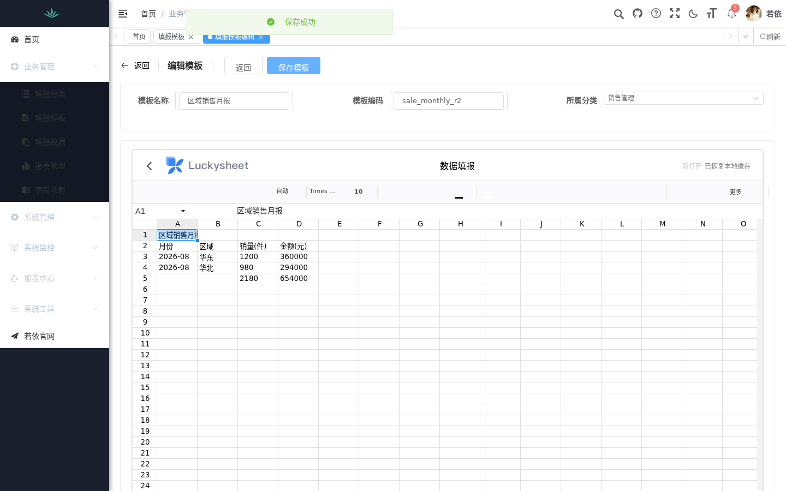

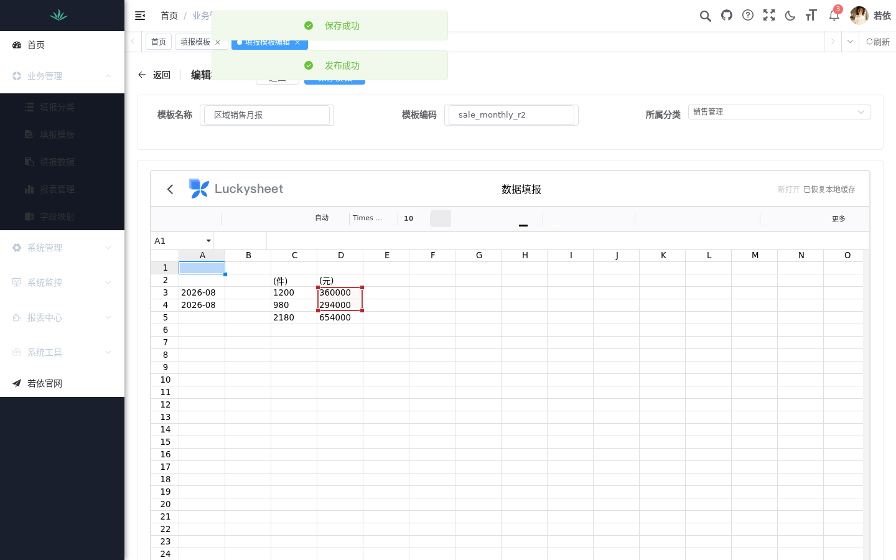

**其他操作:**

| 操作 | 说明 |
|------|------|
| **修改** | 修改模板名称/分类/描述 |
| **预览** | 只读模式查看模板效果 |
| **复制** | 一键克隆模板为"未发布"副本(名称加"-副本",编码自动重新生成),复制后直接进入设计器 |
| **下架** | 暂停填报;已打开的填报页不能再新建填报(保存中的草稿不受影响);可再次发布 |
| **删除** | 逻辑删除,其下草稿数据一并清理;**注意:编码即使删除后也不能被新模板重复使用** |
| **导出** | 导出模板列表为 Excel |
| **版本号** | 保存修改与发布均自动递增(下架不动);填报数据会记录提交时所用的模板版本,可在详情中追溯 |

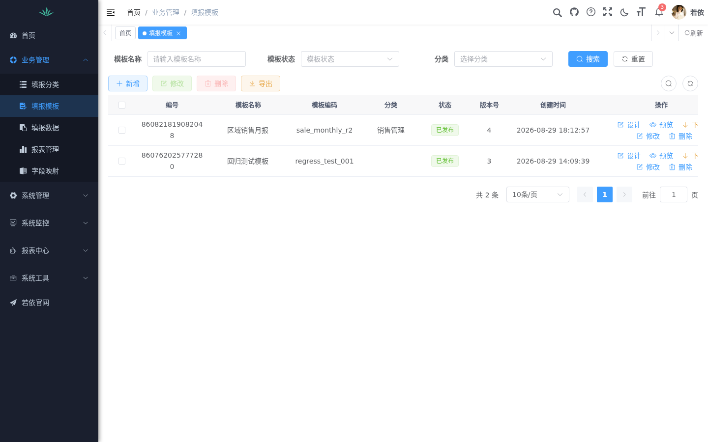

### 3.3 在线表格设计器使用要点

- **录入:** 单击选中单元格后直接输入,回车确认;双击进入编辑模式可修改已有内容。
- **公式:** 与 Excel 语法一致,支持 `SUM`、`AVERAGE`、跨单元格引用等常用函数。
- **复制粘贴:** 支持单元格/区域复制粘贴,支持右键菜单(插入行列、删除、隐藏等 20+ 项操作)。
- **绑定字典:** 选中单个单元格 → 点击设计器上方的 **绑定字典** → 选择 RuoYi 字典类型(可勾选"必填")。填报端该单元格变为下拉选择,提交时后端校验取值合法性;**清除绑定** 可解除。
- **图片上传:** 填报时插入/粘贴的图片自动上传到服务器,工作簿中仅保存图片链接,不会导致数据膨胀。
- **图表:** 选中数据区域后,通过工具栏"更多 → 图表"插入折线图/柱状图等。
- **常用技巧:** 工具栏右侧"更多"按钮收纳了低频按钮(图表、批注、求和、冻结、筛选等)。

### 3.4 在线填报

**操作路径:** 数据填报 → 我的填报 → 新增

1. 点击 **新增**,在下拉框中选择要填报的**已发布模板**。

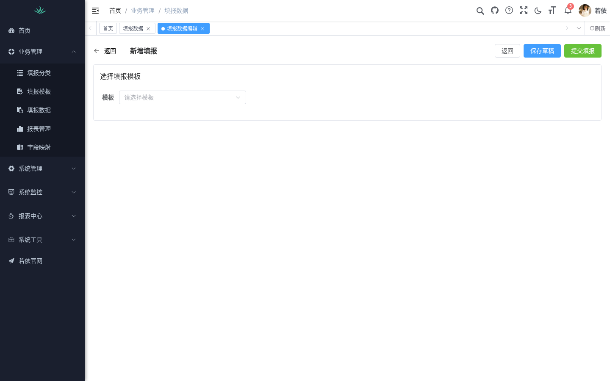

2. 系统按模板生成填报表格,填写业务数据(示例中将华北销量调整为 1050,并新增华南一行)。

3. **批量导入:** 已有 Excel 台账时,点击表格区域右上角 **导入 Excel**,本地解析后从 A1 起写入第一个工作表(单次上限 500 行 × 50 列,导入前有覆盖确认)。
4. **自动保存:** 页面每 30 秒自动保存一次草稿(有改动时),左上角显示"已自动保存 HH:mm";也可随时点击 **保存草稿** 手动暂存(草稿可反复修改)。
5. 填写完成后点击 **提交填报**;提交前系统按模板配置校验必填项与下拉/字典取值,不通过会提示具体单元格。

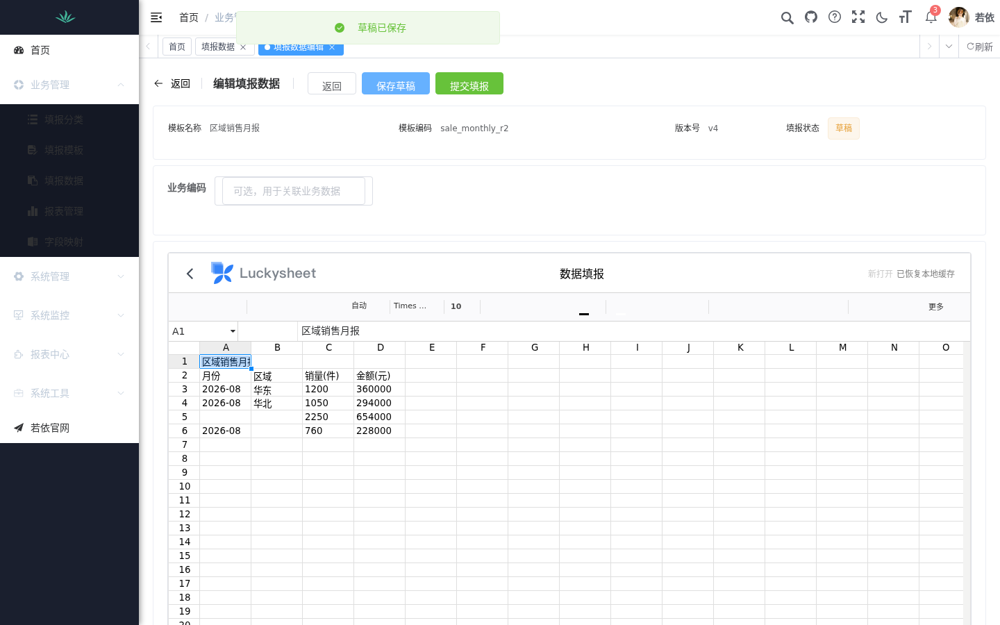

6. 确认后数据**提交锁定,不可再修改**;如需更正请联系管理员。

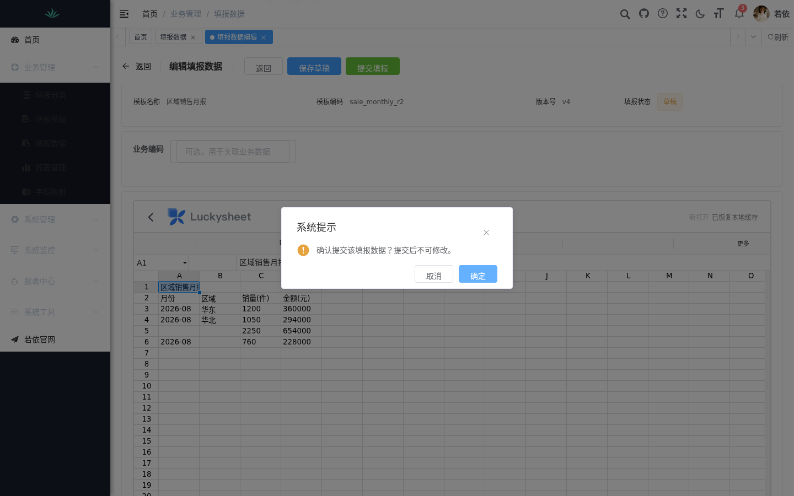

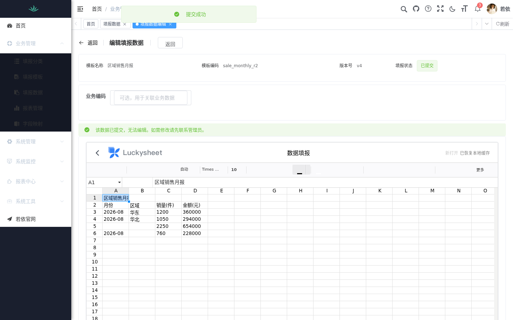

> ⚠️ **注意:** 表单中的"业务编码"为选填项,用于将本条填报与外部业务系统单据关联(如订单号)。

### 3.5 填报数据管理

**操作路径:** 数据填报 → 我的填报

- 列表按模板/状态/时间筛选,展示当前账号数据权限范围内的填报记录(默认仅本人;配置了部门/本部门及以下数据范围的角色可查看相应范围,管理员可见全部)。
- **详情**:以只读表格回放提交时刻的完整数据快照,不受模板后续修改影响;基本信息中可查看填报时所用的**模板版本**。

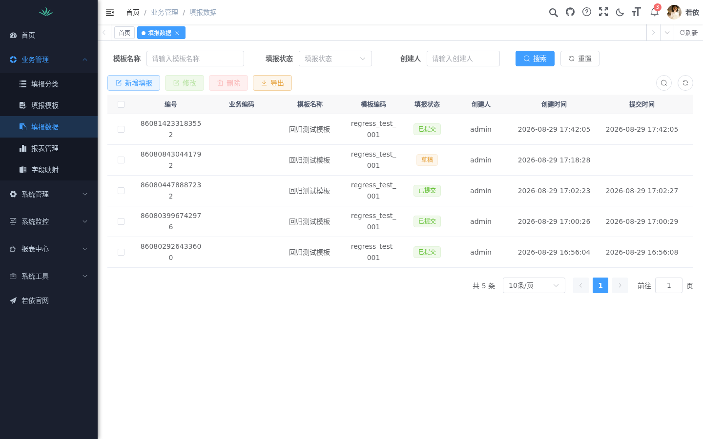

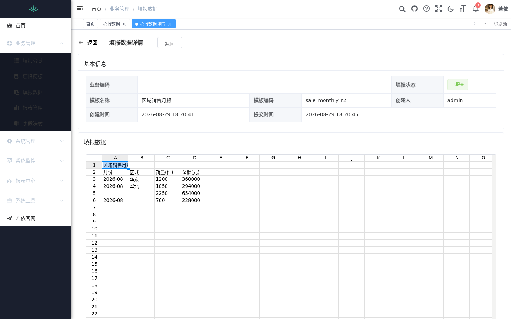

- **导出**:点击 **导出** 创建异步导出任务,后台生成 Excel(单次上限 10 万条),在任务弹窗中查看进度并下载;导出文件保留 24 小时,过期自动清理,失效后需重新导出。
- 草稿状态的数据可**修改**或**删除**;已提交数据为只读。

### 3.6 字段映射(进阶)

**操作路径:** 数据填报 → 字段映射(需 `collect:mapping` 相关权限)

字段映射将模板中的单元格坐标与业务表字段建立对应关系。配置后,填报数据提交时会把指定单元格的值按类型转换后写入业务表,供报表 SQL 直接引用。通常由管理员结合数据库表结构配置,业务用户无需关注。

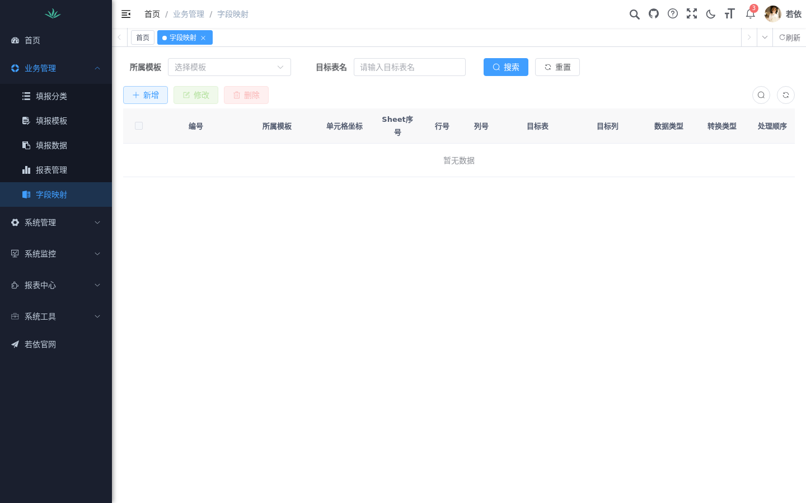

## 4. 报表管理

### 4.1 报表分类

**操作路径:** 报表管理 → 报表分类

树形管理报表分组(如"运营报表/财务报表"),操作方式与填报分类一致。

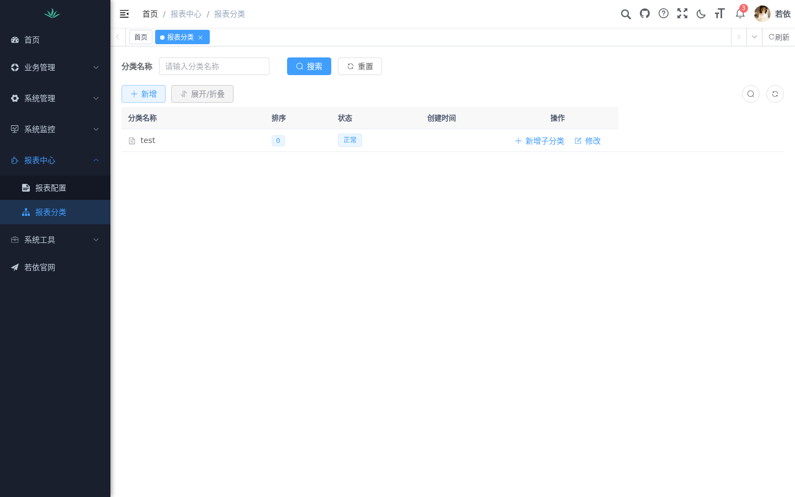

### 4.2 报表配置

**操作路径:** 报表管理 → 报表配置

报表配置是系统报表与报表引擎(JimuReport/JimuBI)之间的桥梁:

1. 在 JimuReport 设计器中设计报表(设计器入口由管理员开启,`/jmreport/list`)。
2. 在本页面 **新增** 报表配置:填写名称、编码、类型(报表/大屏/仪表盘),并填入 JimuReport 报表 ID。
3. 保存后即可在"报表查看"中访问。

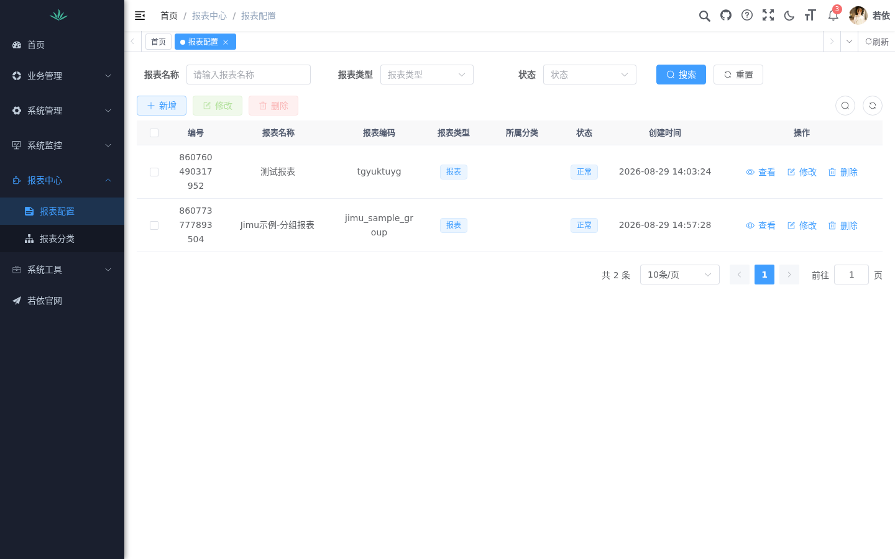

> 💡 **提示:** "报表不存在或已停用"通常表示配置中填写的 JimuReport 报表 ID 不存在或引擎中已删除,请核对 ID。

### 4.3 报表查看

**操作路径:** 报表管理 → 报表查看(或报表配置列表的 **查看** 按钮)

报表以内嵌页面打开,支持翻页、**打印**、**导出**(PDF/Excel/Word 等),右上角可**刷新**与全屏。

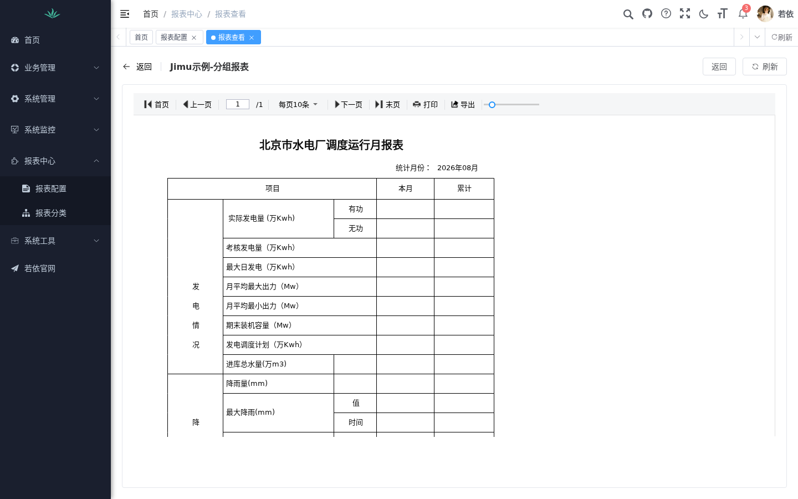

> ⚠️ **注意:** 报表打开需经过一次性票据鉴权(系统自动完成)。若提示无法获取票据,多为会话已过期,重新登录即可。

### 4.4 大屏管理

**操作路径:** 报表管理 → 大屏管理

卡片式大屏列表,展示大屏名称、状态并支持快速查看/编辑配置。

### 4.5 大屏与仪表盘查看

大屏/仪表盘通过 JimuBI 拖拽设计,配置方式与报表一致(报表类型选"大屏"或"仪表盘")。查看页以全屏方式打开,悬浮工具栏(鼠标移动时出现)支持**返回/刷新/自动刷新间隔(30 秒、60 秒、5 分钟)/全屏**切换,适合投影与监控场景。

## 5. 系统管理

用户、角色、菜单、部门、字典、参数、操作日志等系统级功能基于 RuoYi 框架提供,管理员在 **系统管理** 菜单下维护:

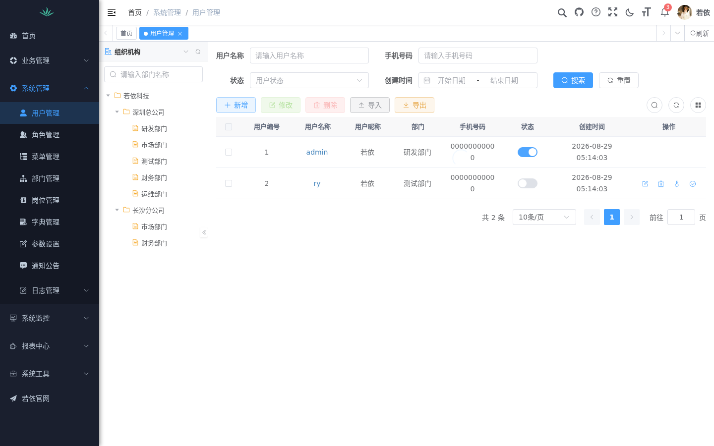

- **用户/角色/菜单管理**:账号开通、权限分配、菜单可见性控制。
- **字典管理**:下拉选项类基础数据(如状态、类型)统一维护。
- **操作/登录日志**:全量审计,可按条件检索。
- 详细用法可参考 [RuoYi 官方文档](https://doc.ruoyi.vip/)。

## 6. 权限速查表

菜单与按钮权限由管理员在"角色管理"中分配,常用业务权限:

| 权限标识 | 控制内容 |
|---------|---------|
| `collect:template:*` | 填报模板的查看/新增/修改(含设计发布)/删除/导出 |
| `collect:data:*` | 填报数据的查看/新增/编辑/删除/导出 |
| `collect:category:*` | 填报分类管理 |
| `collect:mapping:*` | 字段映射管理 |
| `report:config:*` | 报表配置与查看 |
| `report:category:*` | 报表分类 |

> 数据行级权限:填报数据默认按部门数据权限隔离;报表内的数据过滤由报表 SQL 参数实现(参见 `doc/1-设计文档/02-功能模块详细设计.md` §2.3)。

## 7. 常见问题 FAQ

**Q1:登录提示"验证码错误"?**
验证码有效期约 2 分钟且一次有效;超时或输错后点击验证码图片刷新再输入。

**Q2:密码输错被锁?**
连续错误 5 次锁定 10 分钟,稍后再试或联系管理员重置。

**Q3:填报下拉里看不到模板?**
只有**已发布**状态的模板才会出现在填报入口,请确认模板已发布且未下架。

**Q4:新建模板提示"编码已存在"?**
模板/报表编码全局唯一,且**已删除模板的编码仍被占用**,请更换一个新编码。

**Q5:提交后发现数据填错?**
已提交数据被锁定,不能修改也不能删除。请复制一个新填报重新提交,或联系管理员处理。

**Q5b:提交提示"提交校验未通过"?**
模板设计者为部分单元格开启了必填或字典校验,按提示补充/更正对应单元格后重新提交。

**Q5c:下拉单元格为什么不能自由输入?**
该单元格被绑定了字典下拉,只能从列表选择;如需自由输入请联系模板设计者解除绑定。

**Q5d:导出任务失败或文件下载提示"已失效"?**
导出文件保留 24 小时后自动清理;失效任务需重新导出。任务持续失败时缩小筛选范围(如按模板/时间段)后重试。

**Q6:设计器/报表页面空白或图表按钮缺失?**
图表组件依赖公共 CDN 资源,请确认网络可访问公网;刷新页面重试。若仍空白,清浏览器缓存后重新登录。

**Q7:操作一段时间后提示会话过期?**
登录会话 30 分钟无操作自动过期,重新登录即可,未保存的草稿数据不会自动丢失(建议养成随手保存草稿的习惯)。

**Q8:报表打开显示"报表不存在或已停用"?**
报表配置中填写的引擎报表 ID 无效,或报表在引擎中被删除/停用,请联系管理员核对配置。

**Q9:如何修改密码?**
右上角头像 → 个人中心 → 修改密码。首次登录建议立即修改初始密码。

---

*本手册对应系统版本:RuoYi-Vue 3.9.2 基座 + Luckysheet 2.1.13(本地 fork)+ JimuReport/JimuBI 2.5.0,更新于 2026-08-30。界面如因版本迭代调整,以实际系统为准。*
