# AllinOne 浏览器交互回归报告（2026-08-29）

> 对应《修复与验证总结_2026-08-28.md》§5.4「浏览器交互回归」事项：验证 jQuery 2.2.4→3.7.1 升级后 Luckysheet 及相关页面的运行时可用性。
> 方式：Playwright + Headless Chromium 黑盒 GUI 测试（点击/键入/截图/DOM 只读校验），覆盖 dev 与 production 两种构建。
> **编者注（2026-08-30）：** 文中涉及的 work_report 报表编辑器已于 2026-08-30 整体下线（tag `archive/workreport-20260830`），相关结论仅具历史价值。

---

## 0. 修复与复跑结论（2026-08-29 第二轮，最终状态）

首轮回归发现的 2 个 P0 缺陷与环境项已全部修复并复跑验证，**Luckysheet 填报链路与 JimuReport 查看链路在 dev 和 production 构建下均恢复正常**：

| 修复项 | 变更 | 复跑结果 |
|--------|------|---------|
| 缺陷 #1：Luckysheet 运行时加载失败 | `CollectSheet` 改为按序注入经典 `<script>`（plugin.js 内含 jQuery 先行）；新增 vite 插件把 `allinone-luckysheet/dist` 以 `/luckysheet/` 固定站点路径提供（dev 中间件 + build 后拷贝）；`server.fs.allow` 放行字体等静态资源 | 设计器/填报/详情页加载、渲染、编辑全部正常（dev+prod） |
| 缺陷 #1 附带：图表按钮缺失 | `luckysheet.create` 增加 `plugins: ['chart']`；luckysheet 源码中 chartmix 路径改为锚定主库 `<script>` URL（相对路径在 SPA 路由下解析到页面路由导致 404）并重新构建 dist | 图表按钮出现，选中区域插入折线图成功（echarts 渲染、双系列） |
| 缺陷 #1 附带：模板数据重放竞态 | `CollectSheet.loadData` 等待库就绪再 `destroy()`（生产构建下模板接口先于脚本执行完成返回，旧代码在此抛错并丢弃重放数据） | 生产构建设计器重开正确还原图表与全部单元格数据，零 pageerror |
| 缺陷 #2：ticket 字段错位 | `JimuTicketController` 改用 `AjaxResult.success(msg, data)` 重载（String 实参此前绑定到 `success(String message)`，票据进了 msg） | 报表查看 iframe 携带 ticket 正常渲染 JimuReport 复杂表头报表 |
| 查看页错误混淆 | `report/view` 区分"配置不存在/停用"与"取票失败"两种空态文案 | 生效 |
| 环境项：UI 模式启动失败 | `application.yml` 的 `minidao.base-package` 补齐 `jmreport.ai.tablemeta.dao*` 与 `drag.dao*` | `JIMUREPORT_UI_ENABLE=true` 直接启动成功（无 CLI 覆盖） |

**修改文件：** `allinone-typescript/src/components/CollectSheet/index.vue`、`allinone-typescript/vite.config.ts`、`allinone-typescript/src/views/report/view/index.vue`、`allinone-admin/.../JimuTicketController.java`、`allinone-admin/.../application.yml`、`allinone-luckysheet/src/expendPlugins/chart/plugin.js`（+重建 dist）。

修复后关键证据：

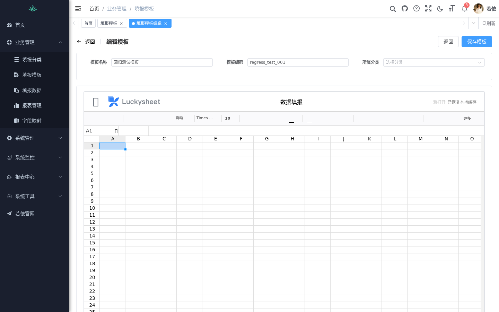

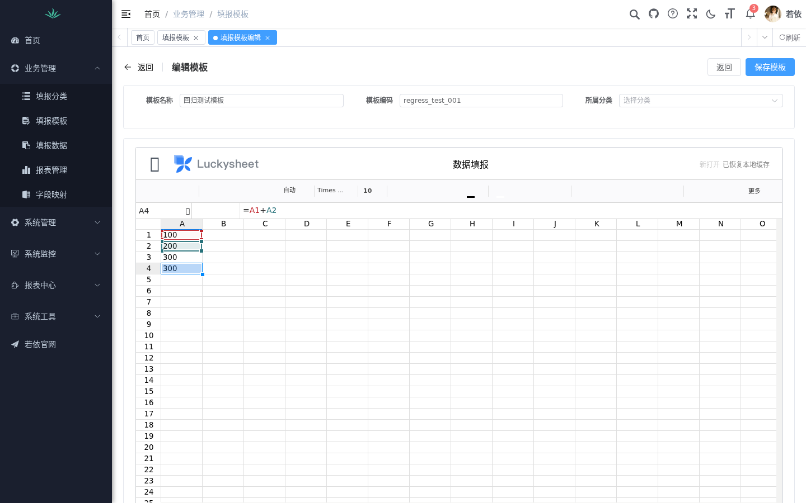

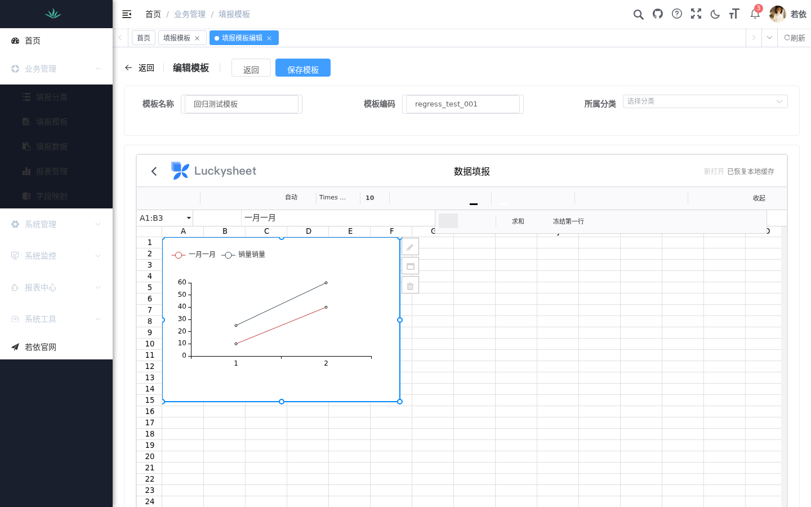

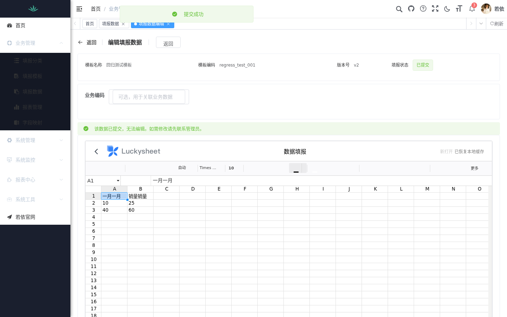

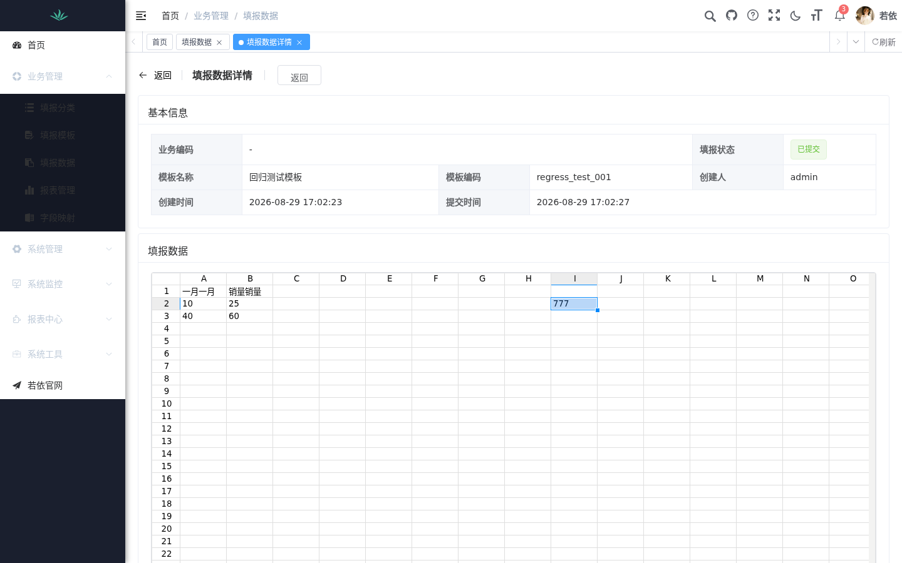


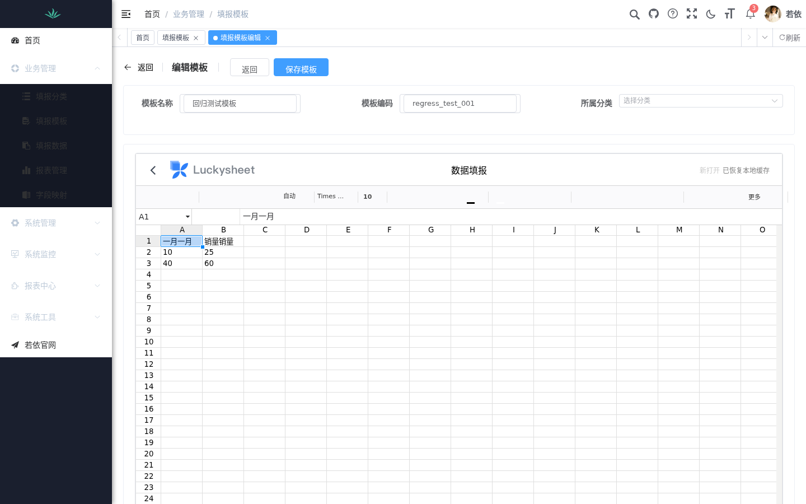

**回归验证（修复后）：** 后端 Maven 测试 18/18 通过、前端契约测试 1/1 通过、生产构建成功；GUI 复跑通过项见 §3.1，新增通过项：单元格编辑、公式（SUM/直接引用）、右键菜单、复制粘贴、图表插入、模板保存/发布、填报（选模板→改数→草稿→提交）、详情快照回放（含修改值一致性 H2=777）、报表查看 iframe。

**已知遗留状态更新（2026-08-29 多智能体修复轮后）：**
1. ~~图表跨页面重开不还原~~ **已解决**：实测根因有二——① 多 Sheet 工作簿中非活动 Sheet 的 chart 数组含 undefined/null 空位，renderCharts 循环遇空位抛错并中断全部渲染；② chartmix 走公网 CDN 异步加载，慢网络下渲染延迟明显。已修复：luckysheet 源码对图表循环增加空位守卫与 try/catch（单图表失败只跳过自身），chartmix 及其依赖（vue2.6.11/vuex3.4.0/element-ui2.13.2/echarts4.8.0）本地化为 `expendPlugins/chart/lib/`。实测重开即渲染、CDN 请求 0 次。
2. ~~chartmix 依赖走公网 CDN~~ **已解决**（同上，依赖本地化随仓库提交约 1.7MB）。遗留：print 插件仍硬编码 `localhost:8080`（未启用打印插件则无感）。
3. 提交后偶发 pageerror 的直接抛出点（renderCharts 空位）已由守卫消除；chartmix store 内部残余 2 条瞬态 pageerror（`chartOptions`/`chartAllType`）为上游 store 初始化噪音，无功能影响（图表渲染、保存、回放均正常）。经评估**挂起不修**：彻底根除需调试压缩产物的 store 键控逻辑，工作量不可控且不影响任何用户可见功能。
4. 另修复同轮发现：work_report 报表编辑器复制了同一 Luckysheet 加载缺陷（已统一至共享加载器）；填报数据导出只含元数据（已改为按快照生成每记录数据工作表）；草稿自动保存缺失（已实现 30 秒静默自动保存）；报表配置 ID 来源无指引（已加说明文字）。

---

## 1. 首轮回归结论速览（修复前快照，最终状态见 §0）

| 结论 | 说明 |
|------|------|
| **发现 2 个 P0 运行时缺陷** | 填报设计器完全不可用（dev+prod）、报表/大屏查看链路不可用 |
| 通过 8 项基础流程 | 登录、菜单路由、模板 CRUD 入口、发布流、模板选择、报表配置 CRUD、查看页错误分支等 |
| Luckysheet 交互验收（编辑/公式/复制粘贴/右键/图表/保存/回放） | **全部被缺陷 #1 阻断，未能执行** |
| jQuery 升级专项回归 | **无法进行**——设计器加载即失败，升级本身尚未引入可见的回归面 |

**本次回归的核心价值：** 静态审查 93 条修复后构建与测试全绿，但系统最核心的两条业务链路（Luckysheet 填报、JimuReport 查看）在真实浏览器中**从加载第一步就不可用**。此前各轮验证只覆盖了构建通过和后端测试，从未实际打开过页面。

---

## 2. 环境准备记录（区别于测试产生的状态）

- Docker 中重建 `mysql`(8.0, 端口 3306) 与 `redis`（数据卷 `/app/mysql/data` 未动）；按 `doc/SQL_EXECUTION_ORDER.md` 顺序导入全部 6 个 SQL（90 张表），通过 `@bootstrap_password_bcrypt` 设置本地 admin 密码。
- 后端以 `JIMUREPORT_UI_ENABLE=true` 启动失败（见第 5 节环境项），最终以 CLI 覆盖 `--minidao.base-package` 三个包启动成功。
- 前端 dev server（Vite 6, 端口 80）；另执行 `npm run build:prod` 并以静态服务器 + 反向代理在 4173 端口验证生产构建。
- 安装 fonts-noto-cjk 解决 headless Chromium 中文渲染；Playwright/Chromium 安装于 /tmp/e2e（不涉及项目依赖）。

---

## 3. 测试点结果

### 3.1 通过项

| # | 测试点 | 证据 |
|---|--------|------|
| T1 | 登录页渲染、数学验证码、admin 登录成功跳转 /index | 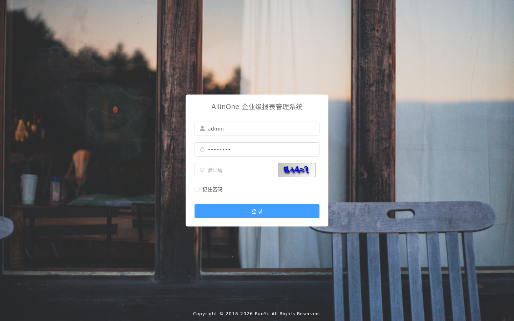 |
| T2 | 首页/侧边栏/页签渲染，中文字体正常 | 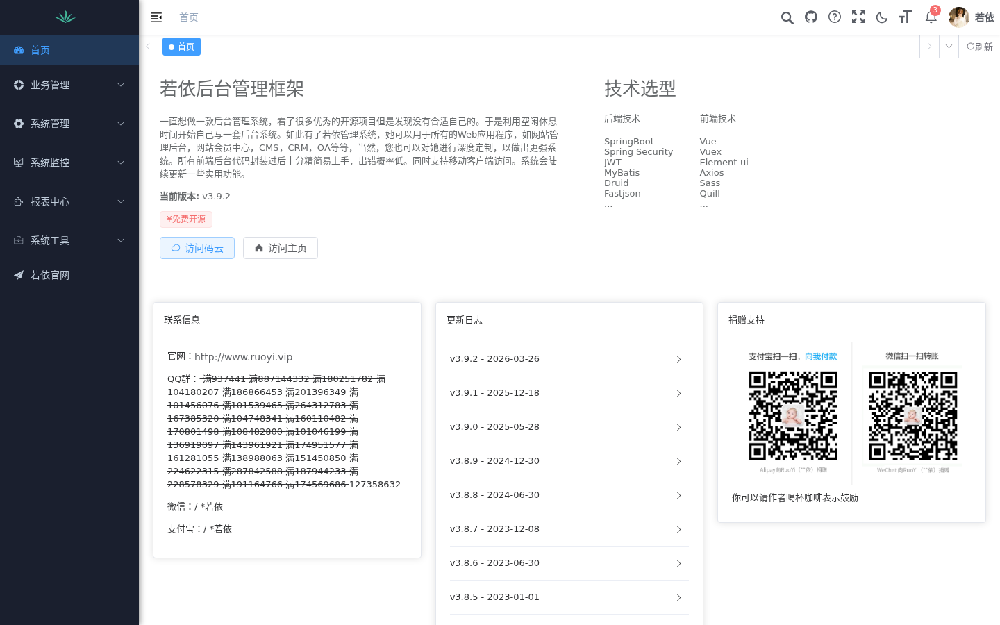 |
| T3 | 业务管理→填报模板列表、新增模板弹窗校验与创建 | 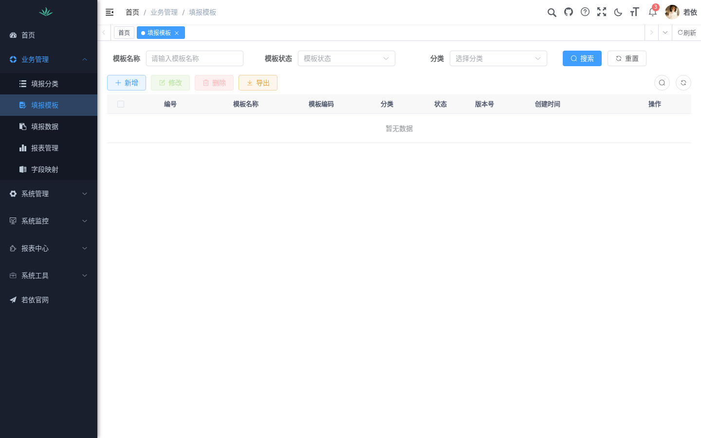 |
| T4 | 模板编辑页框架（名称/编码/分类表单、返回/保存/发布按钮） | 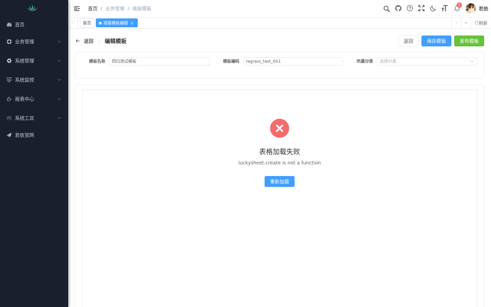 |
| T5 | 模板发布：确认框文案正确，状态 未发布→已发布，操作变下架 | 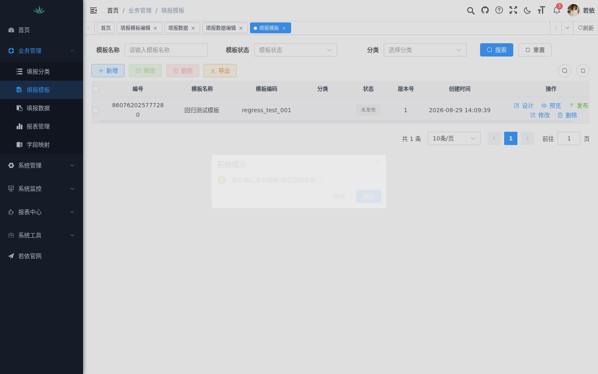 |
| T6 | 填报数据列表、新增填报页、模板下拉正确加载已发布模板 | 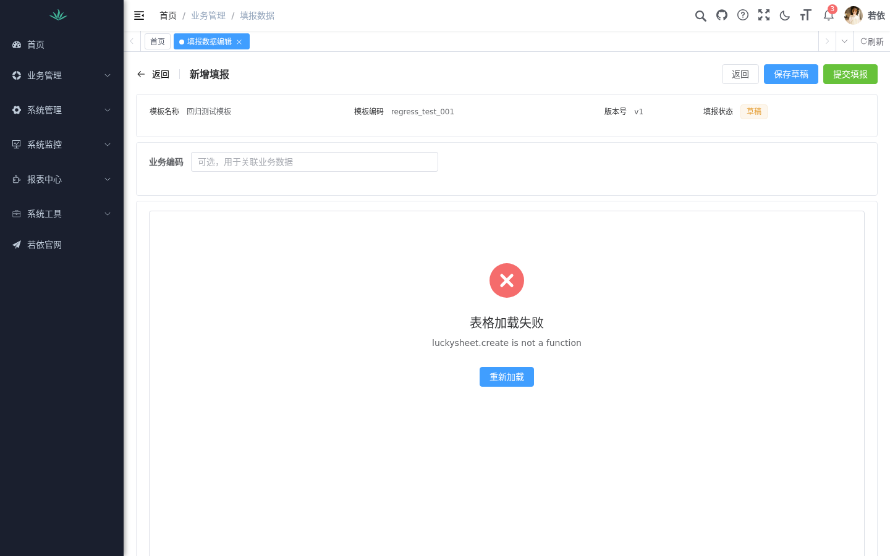 |
| T7 | 报表配置列表/新增弹窗/保存成功；查看页对无效 jimu id 正确报"报表不存在或已停用" | 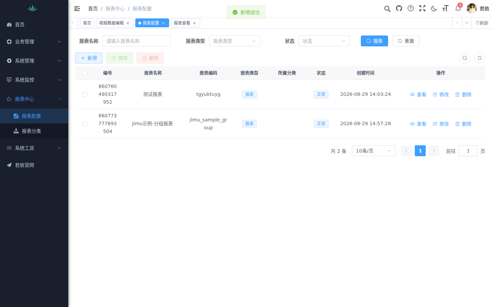 |
| T8 | 报表管理（work_report）列表页正常加载 | 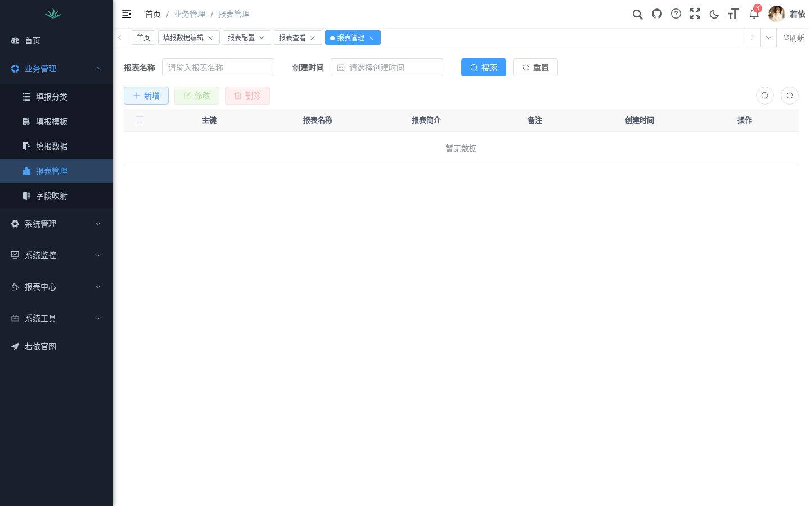 |

全程无任何 console.error（除两处缺陷自身的报错）；登录态、权限菜单、验证码、分页组件均工作正常。

### 3.2 缺陷

#### 缺陷 #1（P0，阻断全部填报链路）：Luckysheet 运行时加载失败

- **现象：** 模板"设计/预览"、填报数据编辑打开后，CollectSheet 组件报错，页面显示"表格加载失败"，无任何 canvas 渲染。
- **报错：** `[CollectSheet] init error: TypeError: luckysheet.create is not a function`（`src/components/CollectSheet/index.vue:83`）。
- **复现：** 100% 复现（页面重载、重新进入均一致），**dev 与 production 构建均失败**（生产构建报压缩后的 `t.create is not a function`）。
- **运行时证据（dev）：**
  - `window.luckysheet` 存在但是**空对象**（0 个属性，无 `create`）；
  - `window.$` 为 `undefined`——原始 `dist/luckysheet.umd.js` 顶层引用全局 `$`（jQuery），以 ES Module 方式动态 `import()` 时抛 `ReferenceError: $ is not defined`，模块求值中断，末行 `window.luckysheet = luckysheet` 永不执行；
  - dev 下 Vite 将该 `file:` 链接依赖重写到 `.vite/deps/luckysheet.js`（实际 404——链接依赖不参与预打包）。
  - `CollectSheet.loadLuckysheet()` 的动态 `import('luckysheet')` + `import('luckysheet/dist/plugins/js/plugin.js')` 方案依赖"脚本全局注入"，在 Vite 的模块化加载下不成立。
- **影响面：** 所有基于 CollectSheet 的页面——模板设计/预览、填报数据编辑/详情回放、work_report 报表编辑器。设计意图中的编辑、公式、复制粘贴、右键菜单、图表、保存、重开全部无法验证。
- **修复方向（供修复阶段参考）：** 将 `allinone-luckysheet/dist` 作为静态资源放入前端 `public/` 并按序注入 `<script>`（jQuery → plugin.js → luckysheet.umd.js），或为本地构建产物提供真正的 ESM 包装；删除对 `window.luckysheet` 的动态 import 依赖。


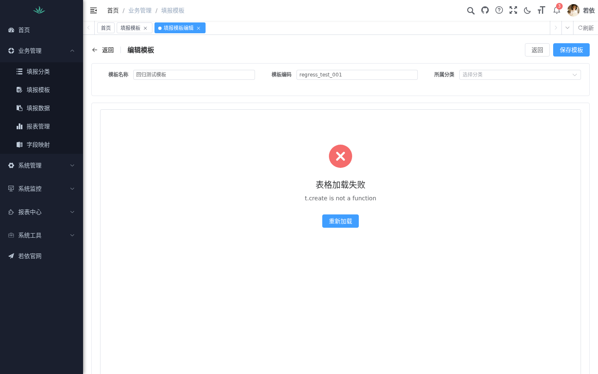

#### 缺陷 #2（P0，报表/大屏查看链路不可用）：一次性 ticket 字段错位

- **现象：** 报表配置指向**真实存在**的 JimuReport 报表时，查看页仍显示"报表不存在或已停用"，iframe 不渲染。
- **根因：** `JimuTicketController.generate()`（`allinone-admin/.../JimuTicketController.java:53`）调用 `success(ticket)`。由于 RuoYi `BaseController/AjaxResult` 的重载，**String 实参绑定了 `success(String message)`**，ticket 被放进 `msg` 字段：
  ```json
  {"msg":"576bc2f0-91c2-41f0-8fde-a17d7b528eec","code":200}
  ```
  而前端 `report/view/index.vue` 的 `buildSrc()` 读取 `response.data` → 恒为 null → 抛"无法获取报表访问票据" → src 为空 → 显示误导性的"报表不存在或已停用"。
- **实证：** 登录态下 `POST /system/jimu/ticket` 返回如上；同请求 `GET /report/config/{id}` 返回的 `url`/`status` 字段均正确，排除配置与鉴权问题。
- **修复方向：** 后端改为 `AjaxResult.success("操作成功", ticket)`（或 `success((Object) ticket)`）；前端 view 页对"取票失败"与"配置不存在"给出不同提示，避免误导。
- **附带发现（低）：** 查看页将 ticket 失败与配置缺失渲染为同一提示（上文混淆点）。

#### 环境项（非缺陷，需修配置）：JIMUREPORT_UI_ENABLE=true 无法启动

- `application.yml` 的 `minidao.base-package` 仅含 `org.jeecg.modules.jmreport.desreport.dao*`。开启积木设计器 UI 后，JimuReport AI 模块与 JimuBI 拖拽模块的 DAO（`...jmreport.ai.tablemeta.dao.C2bTableMetaDao`、`...drag.dao.OnlDragDataSourceDao`）不被扫描，启动即 Bean 注入失败。
- 本次以 `--minidao.base-package=org.jeecg.modules.jmreport.desreport.dao*,org.jeecg.modules.jmreport.ai.tablemeta.dao*,org.jeecg.modules.drag.dao*` 临时绕过；仓库配置应补齐这两个包。

---

## 4. 被阻断、修复后需重跑的验收项

1. Luckysheet 加载（工具栏/公式栏/sheet 页签/行列头渲染）
2. 单元格编辑与公式计算（=SUM、=A1+A2、跨 sheet 引用）
3. 复制/粘贴、右键菜单（jQuery 升级重点观察区）
4. 图表插入
5. 模板保存→列表→发布
6. 填报：选模板→填数→保存草稿→提交→状态锁定
7. 详情回放快照一致性
8. 报表查看：ticket 换取→iframe 渲染→导出

测试脚本与浏览器守护进程保留在 `/tmp/e2e`（step.js 分步执行框架），修复后可直接复跑。

---

## 5. 测试遗留数据

- 模板「回归测试模板」(regress_test_001, 已发布, templateJson 为空)
- 报表配置「Jimu示例-分组报表」(jimu_sample_group → 积木示例 1178206795504078848)、「测试报表」(无效 id，页面用于验证错误分支)
- 本地 admin 密码：admin123（仅本地环境，未入库提交）
- 截图证据：`gui-test-screenshots/`（21 张，t1–t10 编号与测试点对应）
